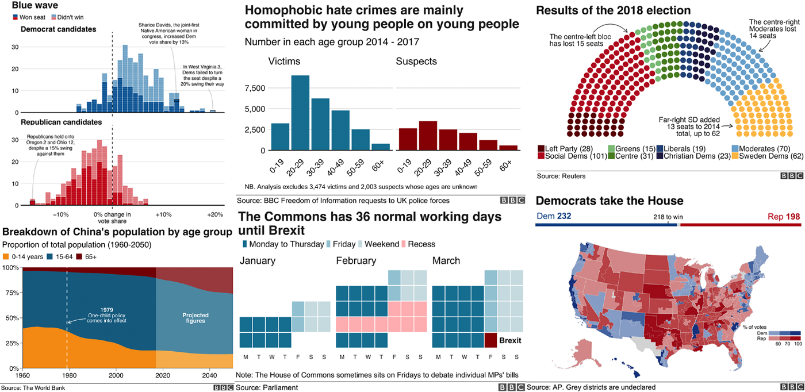
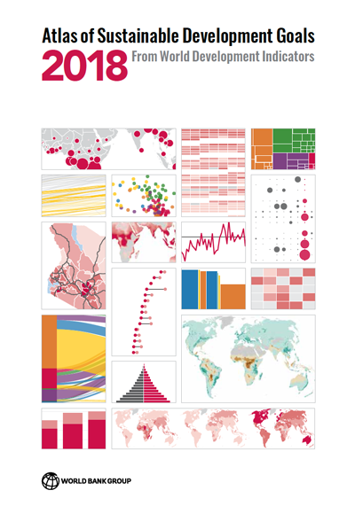
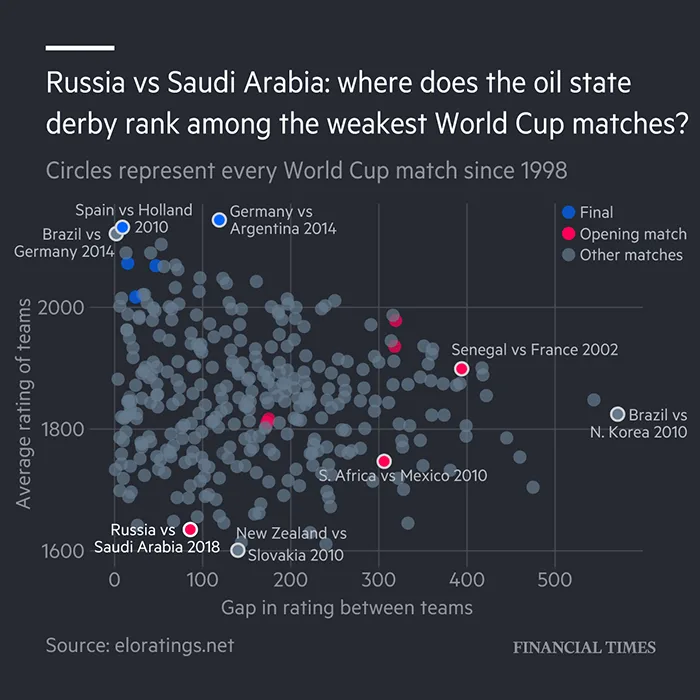
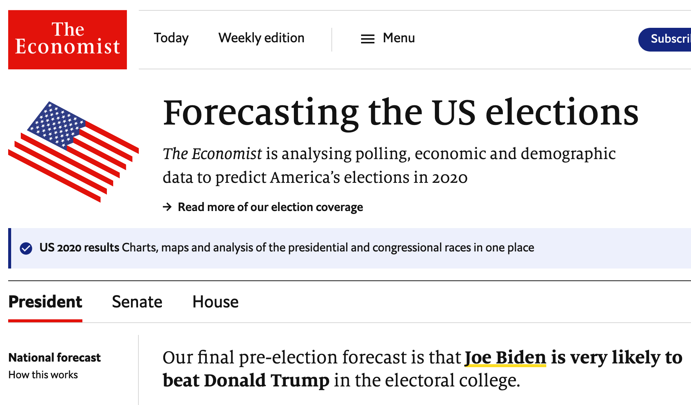
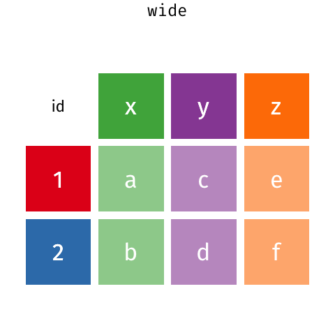

```{r setup, include=FALSE}
options(htmltools.dir.version = FALSE)
knitr::opts_chunk$set(fig.retina = 3, echo = F,
                      cache = F,
                      warning = F,
                      comment = "",
                      dev = "ragg_png",
                      fig.showtext = T,
                      message = F)
library(fontawesome)
library(tidyverse)
library(pragr)
library(ptrr)
library(ragg)
library(knitr)

library(xaringanExtra)
library(flipbookr)

ptrr::set_geom_defaults()
update_geom_defaults("rect", list(fill = "blue"))

options(tibble.print_min = 20)
```


```{css}
.remark-slide-number {
  display: none;
}

```

```{r}
xaringanExtra::use_xaringan_extra("share_again")

xaringanExtra::style_share_again(
  share_buttons = c("twitter", "linkedin", "pocket")
)

xaringanExtra::use_extra_styles(
  hover_code_line = TRUE,         
  mute_unhighlighted_code = TRUE  
)
```


```{r xaringan-themer, include=FALSE, warning=FALSE}
library(xaringanthemer)
style_mono_accent(
  base_color = "#0000ff",
  header_font_google = google_font("IBM Plex Sans"),
  text_font_google   = google_font("IBM Plex Sans"),
  code_font_google   = google_font("IBM Plex Mono"),
  table_row_even_background_color = "fff"
)
```

```{r fonts, include=FALSE}
sysfonts::font_add_google("IBM Plex Sans", "Roboto")
sysfonts::font_add_google("IBM Plex Sans Condensed", "Roboto Condensed")
```

```{r meta, echo=F}
library(metathis)
meta() %>%
  meta_general(
    description = "Workshop o datové analytice v R, konference EJ NOK říjen 2020",
    generator = "xaringan and remark.js"
  ) %>% 
  meta_name("github-repo" = "petrbouchal/eval2020") %>% 
  meta_social(
    title = "Efektivní a přehledná práce s daty v prostředí jazyka R",
    url = "https://petrbouchal.xyz/eval2020",
    image = "https://petrbouchal.xyz/eval2020/slides/twitter_card.png",
    image_alt = "První slide prezentace o využití otevřených dat v R",
    og_type = "website",
    og_locale = "cs_CZ",
    og_author = "Petr Bouchal",
    twitter_card_type = "summary_large_image",
    twitter_creator = "@petrbouchal"
  ) %>% 
  write_meta("meta.html")
```

---
class: left, middle, inverse

# Proč tu jsme: cíle pro dnešek

---
class: left, top, large

 1\. Ujasnit si, kdy a proč použít na data programovací jazyk (R)

--

 2\. Naučit se vyznat se v R a RStudiu

--

 3\. Poznat nástroje na práci s daty

--

 4\. Poznat nástroje na tvorbu výstupů

--

 5\. Vědět, kde a jak se učit další věci

---

# A co není cílem

.large[

pokrýt všechny nástroje do hloubky

naučit se statistiku

řešit "big data" / "umělou inteligenci" a další buzzwords

]

---

class: middle, inverse

# Jak na to půjdeme

---
class: middle

.large[
1\. Motivace
]

--

.large[
2\. Stavební kameny
]

--

.large[
3\. Ukázkový projekt
]

--

.large[
4\. Kam dál
]

Celou dobu budeme používat data Google Mobility: https://www.google.com/covid19/mobility/

---

class: middle, inverse

# Motivace: proč na data s kódem


---

layout: true

## Jste v dobré společnosti


---



---



https://blogs.worldbank.org/opendata/2018-atlas-sustainable-development-goals-all-new-visual-guide-data-and-development

https://github.com/worldbank/sdgatlas2018/blob/master/sdg11.R#L15-L72

---



---



https://projects.economist.com/us-2020-forecast/president

---

class: large
layout: false

# Proč R

.pull-left.center.middle[

Open source

Flexibilita

*Komunita*

]

.pull-right.center.middle[
Data

Vizualizace a reporty

*RStudio*
]


---

class: center, middle

.large[

[petrbouchal.xyz/eval2020](https://petrbouchal.xyz/eval2020)

]

---

class: middle, inverse

# Stavební kameny

---
class: middle, large

1\. R a RStudio: prostředí

--

2\. Základní funkce a operace

--

3\. Práce s tabulkovými daty

--

.large[
4\. Nástroje na tvorbu výstupů
]

---
class: middle, large

**1\. R a RStudio: prostředí**

2\. Základní funkce a operace

3\. Práce s tabulkovými daty

4\. Nástroje na tvorbu výstupů

---

class: center, middle, large

otevřete RStudio ([cloud.rstudio.com](https://cloud.rstudio.com))

---
class: middle, large

1\. R a RStudio: prostředí

**2\. Základní funkce a operace**

3\. Práce s tabulkovými daty

4\. Nástroje na tvorbu výstupů

---
class: large, center, middle

otevřete `01_prvni-skript.R`

---

class: large

# Vsuvka: kde hledat pomoc

- `?funkce` / `??cokoli`
- klik na funkci ve skriptu, pak F1
- "Google the error message"
- Stack Overflow
- RStudio Community
- webová dokumentace balíků

---

class: middle, large

1\. R a RStudio: prostředí

2\. Základní funkce a operace

**3\. Práce s tabulkovými daty**

4\. Nástroje na tvorbu výstupů

---
class: large

# Tidyverse: co to je

- sada balíků s podobnými principy používání
- postaveno na potřebách práce s tabulkovými daty (řádky, sloupce)
- vychází z analogie s gramatikou: pro každou oblast existuje sada základních sloves
- odpovídá logice datové analýzy

---
class: left, top

# Tidyverse: základní logika
.center.middle[

]

---
class: large

# Co balík, to sada úloh datové analýzy

.center[
```{r, out.width="60%"}
include_graphics("tidyverse-logos.png")
```
]


---
class: large

# Co balík, to řešení sady problémů datové analýzy

- `readr` načítání dat z textových souborů (CSV, TSV)
- `readxl`: import dat z Excelu
- `dplyr`: základní manipulace s daty
- `tidyr` na čištění a úpravu dat
- `stringr`: práce s textem
- `lubridate` práce s datumy a časy
- `ggplot2`: vizualizace dat

---
class: large, center, middle

[dplyr.tidyverse.org](https://dplyr.tidyverse.org)

[readr.tidyverse.org](https://dplyr.tidyverse.org)

...

Reference | Articles

---

## Další:

- `forcats` na práci s faktory (kategorická data)
- `httr` a `rvest` na stahování a scrapeování dat z webu
- `tibble` na tvorbu data frames
- `glue` na slepování textu / textu a dat
- `purrr` na opakování operací pro různé vstupy

## Související mimo tidyverse:

- `haven` na načítání dan např. z SPSS
- `DBI` a další: kontakt s databázemi
- `writexl` na export dat do z Excelu
- `sf` na práci s geografickými daty

---

class: large

*Slovesa* v tidyverse (balíky `dplyr` a `tidyr`)

- `filter`: výběr řádků podle pravidla
- `mutate`: výpočty ze sloupců
- `summarise`: souhrn  pomocí funkce
- `group_by`: operace po skupinách
- `select`: výběr sloupců (jako v SQL)
- `arrange`: řazení
- `join_*:` spojení dvou tabulek podle klíče
- `pivot_*:` tvarování ("dlouhý" <=> "krátký" formát

---

class: large

Další užitečné

- `count`
- `starts_with` / `ends_with` / `matches`
- `distinct`
- `n_distinct`
- `rename`
- `recode`
- `separate / unite`
- `bind_rows`

---
## Ještě jedna věc: `%>%` (pipe)

```{r include=FALSE}
options(tibble.print_min = 10)

gdta_orig <- read_csv(here::here("data-zdroje", "google",
                          "2020_CZ_Region_Mobility_Report.csv"))

gdta <- gdta_orig %>% 
  pivot_longer(ends_with("baseline"), 
               names_to = "kategorie",
               values_to = "zmena") %>% 
  select(sub_region_1, kategorie, zmena, date, country_region) %>% 
  mutate(kategorie = str_remove(kategorie, 
                                "_percent_change_from_baseline"))
```

`%>%` posilá výstup funkce vlevo jako první argument to funkce vpravo.

.pull-left[
```{r, echo = T}
summarise(
  filter(
    select(gdta, date, zmena), 
    date > "2020-10-01"),
  min_zmena = min(zmena, na.rm = T))
```
]

.pull-right[
```{r, echo = T}
gdta %>%
  select(date, zmena) %>% 
  filter(date > "2020-10-01") %>% 
  summarise(min_zmena = min(zmena, na.rm = T))
```
]

Je to přehlednější a praktičtější: nemusíme číst složené funkce odprostřed, ale vidíme jednotlivé kroky.

`Cmd/Ctrl + Shift + M`

---
## Srovnání práce v 'base' R a tidyverse

.pull-left[
```{r, echo = T}
x <- gdta[gdta$zmena < -45,]
x <- x[,c("kategorie", "zmena")]
x
```
]

.pull-right[
```{r, echo = T}
gdta %>% 
  filter(zmena < -45) %>% 
  select(kategorie, zmena)
```
]

---

class: center, middle, large

# Tidyverse: ukázka

---

`r chunk_reveal("tidyverse-priklad")`
```{r tidyverse-priklad, include = FALSE}
gdta %>%
  select(-country_region) %>%  #BREAK
  rename(kraj_nazev = sub_region_1) %>% #BREAK
  filter(date > "2020-10-01") %>% #BREAK
  mutate(zmena_dec = zmena/100) %>%  #BREAK
  select(-zmena) %>%  #BREAK
  group_by(kraj_nazev, kategorie) %>%  #BREAK
  mutate(zmena_min = min(zmena_dec, na.rm = T), #BREAK2
         zmena_max = max(zmena_dec, na.rm = T)) %>%  #BREAK2
  summarise(zmena_p = mean(zmena_dec, na.rm = T)) %>% #BREAK4
  ungroup() %>%  #BREAK
  arrange(kategorie, zmena_p) %>%  #ROTATE
  arrange(kategorie, desc(zmena_p)) %>%  #ROTATE
  filter(kategorie == "workplaces") %>% 
  replace_na(list(kraj_nazev = "Celá ČR")) %>% 
  gt::gt()
```


---
# Tidy data

```{r, include=FALSE}
gdt_messy <- gdta_orig %>% 
  select(date, sub_region_1, 
         transit = transit_stations_percent_change_from_baseline,
         retail = retail_and_recreation_percent_change_from_baseline) %>% 
  mutate(across(c(transit, retail), ~paste(.x, "pct"))) %>% 
  group_by(sub_region_1) %>% 
  slice(2)
```

.pull-left[
## Co to je

- co řádek, to pozorování
- co sloupec, to hodnota
- každý typ pozorované jednotky je ve své vlastní tabulce
]

.pull-right[
## Proč

- lépe se s tím pracuje (filtr atd.)
- lépe se to vizualizuje
- lépe se v tom vyznám (je jasné, co je hodnota)
]

Zdroj: https://cran.r-project.org/web/packages/tidyr/vignettes/tidy-data.html

---
# Tidy data: příklady

## Untidy

```{r}
head(gdt_messy, 5) %>% kable("html")
```

---

# Tidy data: příklady

## Tidy

```{r}
gdt_messy %>% 
  pivot_longer(c(transit, retail), 
               names_to = "kategorie", 
               values_to = "zmena") %>% 
  separate(zmena, into = c("zmena", "jednotka")) %>% 
  mutate(zmena = as.numeric(zmena)) %>% 
  head(5) %>% kable(format = "html")
```


Taky někdy "dlouhá" a "široká."

Pro různé účely jsou potřeba různé tvary.

Balíky `dplyr` a `tidyr` pomůžou data přeskládat z jednoho tvaru do druhého (`pivot_wider()` a `pivot_longer()`).

---
## Tvary dat: `pivot_longer()/wider()`


Zdroj: https://github.com/gadenbuie/tidyexplain

---

## Propojování dat: `left_join()`


---

class: large, center, middle

otevřete `02_tabulkova-data.R`

---

# Grammar of Graphics: `ggplot2`

Logika, jak přemýšlet o vizualizaci dat: o tom, jak se z čísel stává něco viditelného.

Standardní logika: milý Excele, namaluj mi *sloupcový graf*. Tady máš několik datových řad, něco s nimi udělej.

Logika GG: každý graf má nějaké grafické prvky, které budu kreslit podle toho, na jaká data je navážu, napr:
- osa x, osa y: `x = `,` y =`
- barva/obrys bodu/prvku, průhlednost: `colour`, `alpha`
- velikost bodu: `size`
- rozdělení grafu na víc panelů podle proměnné: `facet_wrap()`, `facet_grid()`
- škály (barevné, číselné - např. logaritmické, velikostní), `scale_*()`
- souřadnicové systémy (standardní karteziánská, polární, geografické): `coord_*()`

```
library(ggplot2)
```

```{r, include=FALSE}
gdta_rij <- filter(gdta, date > "2020-10-01", is.na(sub_region_1))
```


---

```{r, echo = TRUE}
ggplot()
```

---

```{r, echo = TRUE}
ggplot(data = gdta_rij, mapping = aes(x = date, y = zmena)) +
  geom_line()
```

NB vrstvy se přidávají znamínkem `+`

---

```{r, echo = TRUE}
ggplot(data = gdta_rij, mapping = aes(x = date, y = zmena)) +
  geom_line(aes(colour = kategorie)) #<<
```

---

Uvnitř `mapping = aes(...)` se přiřazují proměnné, vně se přiřazují konstanty.

.pull-left[
```{r, echo = TRUE, fig.height = 6}
ggplot(data = gdta_rij,
       mapping = aes(x = date, y = zmena)) +
  geom_line(aes(colour = kategorie)) #<<
```
]
.pull-right[
```{r, echo = TRUE, fig.height = 6}
ggplot(data = gdta_rij, 
       mapping = aes(x = date, y = zmena)) +
  geom_line(colour = "red",  #<<
            aes(group = kategorie))
```
]

---

`r chunk_reveal("ggplot-priklad")`
```{r ggplot-priklad, include = F}
ggplot(gdta_rij, 
       aes(x = date, y = zmena)) + #BREAK
  geom_line(aes(colour = kategorie), 
            size = .5) + #BREAK
  facet_wrap(vars(kategorie)) + #BREAK
  geom_smooth(aes(colour = kategorie)) + #BREAK
  scale_colour_brewer(palette = "Set1") + #BREAK
  theme( #BREAK1
    panel.background = element_rect(fill = "grey95"), #BREAK2
    legend.position = "none" #BREAK2
    ) + #BREAK1
  labs( #BREAK4
    title = "Aktivita podle krajů a typu míst", #BREAK5
    x = NULL, #BREAK6
    subtitle = "Změna proti normálnímu stavu",  #BREAK7
    y = NULL #BREAK7
    ) #BREAK4
```


---
class: middle, large

1\. R a RStudio: prostředí

2\. Základní funkce a operace

3\. Práce s tabulkovými daty

**4\. Nástroje na tvorbu výstupů**

---
# RMarkdown = R + Markdown

Proč počítat a psát zvlášť? Text v Markdown + kód v R = Rmarkdown

Kód v R se do dokumentu vkládá v tzv. *code chunks*. Ty vypadají takhle:

````
```{r, eval=TRUE}`r ''`
1 + 1
```
````

Vytváří se `Ctrl/Cmd+Alt+I`

Chunks můžete spouštět samostatně v průběhu analýzy (`Ctrl/Cmd+Shift+Enter`) a výstup se ukáže hned pod kódem.

Na konci se pak celý dokument zprocesuje čudlíkem "Knit". Výsledkem může být *HTML stránka*, *word*ový dokument nebo *PDF*.


---

class: large

# RMarkdown: přínos

- nemusím kopírovat grafy a čísla tam a zpět
- reprodukovatelnost celé práce
- zmáčknutím čudlíku mám celý report aktualizovaný
- text blízko čísel a grafů - víc času na přemýšlení, míň na přepínání
- vše je jen text: můžu snadno srovnat, co se změnilo

---

## Markdown

Jednoduchý "jazyk", umožňující textovými značkami říct, jak má text vypadat

Např.  

.pull-left[

`**tučný text**`

`*kurzíva*`

<br />

`### Nadpis 3`

Odkaz: `<https://google.com>`

a `[odkaz s textem](https://google.com)`

Kód přímo v textu: dnes je `` `r 
Sys.Date()` ``

]

.pull-right[

**tučný text**

*kurzíva*

### Nadpis 3

Odkaz: <https://google.com>

a [odkaz s textem](https://google.com)

Kód přímo v textu: dnes je `r Sys.Date()`

]

---

class: large,  middle, center

otevřete `report.Rmd`


---

class: inverse, middle, center

.large[
V přípravě
]

---

# Kam dál

.pull-left[

## Širší nástroje

- Git a Github: verzování kódu a spolupráce
- Šablony pro Rmarkdown (Word, PDF)

]

.pull-right[

## R

- Pokročilé úpravy dat (`stringr`, `dplyr::across()`)
- Faktory (balík `forcats`)
- Přístup do databází
- Vizuální styly na míru (`ggplot2::theme()`)
- Tabulky (např. balík `gt`)

## Otevřená data v R

viz [tento dokument](https://petrbouchal.xyz/slides/pssau2020-07/)

]

---

# Kam dál: online knihy


---
class: middle, center, inverse

.large[

(Tato prezentace je také reprodukovatelná: Viz [<span style="text-decoration: underline; color: #fff">kód</span>](https://github.com/petrbouchal/eval2020/blob/main/docs/slides/index.Rmd).)

Prezentaci samotnou najdete na [<span style="text-decoration: underline; color: #fff">petrbouchal.xyz/eval2020/slides</span>](https://petrbouchal.xyz/eval2020/slides).

]

---

class: center, middle

# Poděkování

EJ NOK MMR

Tvůrci tidyverse

Yihui Xie, tvůrce balíku xaringan (nástroj těchto slidů)

Garick Aden-Buie: balíky xaringanExtra, xaringanthemr

flipbookr

---

class: inverse, bottom, right
layout: false

.large[
<a href="https://twitter.com/petrbouchal">`r fa("twitter", fill = "white")`</a> <a href="https://github.com/petrbouchal">`r fa("github", fill = "white")`</a> <a href="https://linkedin.com/in/petrbouchal">`r fa("linkedin", fill = "white")`</a> petrbouchal

pbouchal@gmail.com

]


